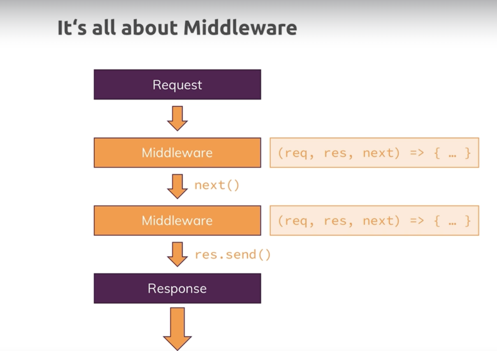

# 1. Introduction

Nodejs is built on top of the javascript that allows us to use many features of javascript add some addition feature to it and able to run it on server outside the browser.
Google V8 is javascript engine that run the javascript in our browser. Javascript engine takes the machine code and convert it to machine code. V8 is written in c++;

Nodejs take the V8 engine and add various features like reading files, editing files which are not possible in the browser. Nodejs doesn't run in the browser. Nodejs uses V8 to run our javascript scripts but these don't run in the browser but are directly executed through that nodejs runtime.

JavaScript on Sever -
Our server has Database, Authentication, Input Validation, Business Logic.
We are not limited to the server for Node.js as it is a Javascript Runtime. We can use it for more than just server-side code. Ex - Utility Scripts, Build Tools etc.

Node.js main role is in web development. We can not only write the code that is running on the server we can also write the server ourselves. So that our code listen for the incoming requests and routes them to our other code. And return the response to those requests.

Running Node.js code -

1. Using REPL (Read User Input, Evaluate the input, Print the Output, Loop) - It is great playground, execute the code as we write it. Not great for writing real applications.
2. Execute files

# 2. Understanding the basics

-> Node.js Program Lifecycle
Event Loop - It is basically a loop process which is managed by nodejs which keeps on running as there is work to do, keeps on running as long as there are event listeners registered. It manages our node application. And nodejs uses this pattern because it need to execute single threaded javascript. So entire node process basically uses one thread on our computer its running on. Behind the scenes it do some multithreading by leveraging the operating system.
We can unregister our event listener using process.exit() in our event listener. Process.exit() basically hard exited our event loop and therefore the program shuts down because there is nor more work to do.

Note- http headers are metadata, meta information added to our request and response object.

On both requests and responses, Http headers are added to transport metadata from A to B.

Stream & buffers - Instead the incoming data is basically sent as a stream of data and that is a special construct javascript in general knows. Our stream here is ongoing process and the request is simply read by node in chunks, this is done so we could start working on the chunks instead having to wait for the full request being read.
We can't arbitrarily try to work with these chunks. Instead to organize these incoming chunks, we use a so-called buffers, a buffer is like a bus stop. A buffer is basically a construct which allows us to hold multiple chunks and work with them before they are released.

Blocking and Non-Blocking Code -
Working with files is available in two modes, synchronous and asynchronous mode.
In synchronous mode , we block the the execution of the next line of code until this file is done.
In asynchronous mode, we don't block the execution of the next line of code.

-> Behind the scenes
Since nodejs runs on a single javascript thread, then it arises the question how can our server handle the multiple requests coming from the clients.
That's where event loop comes in. Event loops is started implicitly by the nodejs when it start executing our code. Event loops only handle event callbacks not simple code, and it will handle only those event callbacks that contains fast finishing code.
Instead our file system operation and a couple of other long taking operations are sent to a worker pool which is also spun up and managed by nodejs automatically.
This worker pool is kind of totally detached of our javascript code and it runs on different thread. It can spin up multiple threads and it's closely intervened with our operating system.
The one connections worker pool will have though to the event loops is that when the work is done it will trigger the callback for that work and since event loops is responsible for the events and the callbacks, this will in the end up in the event loop.
Event loop has order in which it goes through the callbacks.
timers, pending callbacks (i/o callbacks - disk & network operations, file operations).
if there are too many outstanding callbacks, it will continue its loop iteration and postpone these callbacks to the next iterations to execute them.
After working on these open callbacks and finishing them even loop will enter a poll phase. The poll phase is basically a phase where nodejs look for new IO events, basically try to execute their callbacks immediately if possible. Now if that's not possible, it will defer the execution and basically register this a pending callback. It will also see if there are any timer callbacks due to be executed and if that is the case, it will jump to that timer phase and execute them right away. Next setImmediate() callbacks are executed. Then nodejs will execute the close even callbacks.
Internally nodejs keeps the track of its open even listeners and it basically has a counter, references or ref (refs == 0 implies there are no registered even listeners thus our node program can stop).

# 3. Improved Development workflow and debugging

NPM (Node Package Manager) -
Which allows us to manage our project and mostly dependencies.
-> npm init
-> npm install <package-name>
-> npm install <package-name> --save-dev
ex - sudo npm install nodemon -g
-> npm start //need to define in the script
-> npm run start
-> npm run dev
-> npm run build
-> npm run test

The 3rd party packages can be installed using npm in our nodejs program. These packages are present in the npm repository. We can conveniently install and manage them using npm.
-> npm install <package-name>

Packages can be divided into two categories:
Development Packages that help us during development and production dependencies, packages that helps us for the app as it's running on a server. Ex - nodemon will be a development dependency because we use it during the development process.

"dependencies": {
"nodemon": "^3.1.0" //^ tells how package will be installed if we rerun just npm install
}

// In terminal/ command prompt
npm install --save express-session
// In code file (e.g. app.js)
const sessions = require('express-session');

Types of errors :

1. Syntax Errors
2. Runtime Errors

Restarting the debugger automatically
go to run and add configurations and then node.js configurations. In launch.json file add
"restart" : true
"runtimeExecutable" : "nodemon
"console" : "integratedTerminal" #if we want to run in normal terminal
But for this we need to have nodemon install globally

# 4. Working with Express.js

Express is a framework for Node.js.
It give us a rule set in which we work and a lot of utility functions that help us write cleaner code.

Express.js doesn't have a built in way of handling or parsing the data but it make its easy to install another package that can be easily hooked into our project that will then do the parsing for us.
(Framework - A set of helper functions, tools and rules that help us build our application, it will help do the heavy lifting)

Other frameworks for node.js are adonis.js, koa. sails.js.

It give us a certain way of working with the incoming requests and building our application that make it highly extensible. As a there are hundred or thousands of third party packages built for express specifically that we can easily add to our node express application without having to configure a lot.

Express is all about middleware. Middleware means that an incoming requests is automatically funneled through a bunch of functions by express.js. So instead of having just one request handler, we will actually have a possibility of hooking in multiple functions which the request will go through until you send a response. This allows us to split our code into multiple blocks or pieces instead of having one huge function that does everything.

It is best practice to put all the routing related code for different paths and https methods into one folder separate from our main code.
Views folder of our project contains only the html files that need to be served.

# 5. Working with Dynamic Content & Adding Templating Engines

Dynamic content means that the content of the page is not static. It can change based on the data that is being sent.

We have HTMLish Template which is our html files with the placeholders, and then we have our node/express content, and then there is templating engine which understands a certain syntax for which is scans your html-ish template and where it then replaces placeholders or certain snippets depending on the engine we are using with the real html content but that html content it uses is generated on the fly, on the server by the templating engine taking that dynamic content in account.
Available templating engine- EJS, Pug(Jade), Handlebars.
Templates are not the part of server side code.

Pug - we can extend the pug layout from inside our other pug views and we can define some placeholder, some hook in the layout where the other layout can extend their content.

# 6. MVC

MVC - It is about separation of concerns. So different part do different things and its easy to figure out what is responsible for what.
Models- These are basically objects or is a part of our code that is responsible for representing our data, allowing us to work with that data.
So things like saving data, fetching data to or from a file or even if it's just in memory.
Views - These are the html files that are responsible for rendering the data that we get from the models. These are decoupled from our application code and just having some light or minor integrations regarding the data we inject into our templating engine to generate these views.

Controllers - These are the functions that are responsible for handling the incoming requests and then sending the response. These are the connection point between the model and the views.
It is split across our middleware functions.

9. Dynamic Routes and Advanced Models
   For get requests we can't put the data in post body but only pass it through the url but in post request we can pass the data directly through the post body.
